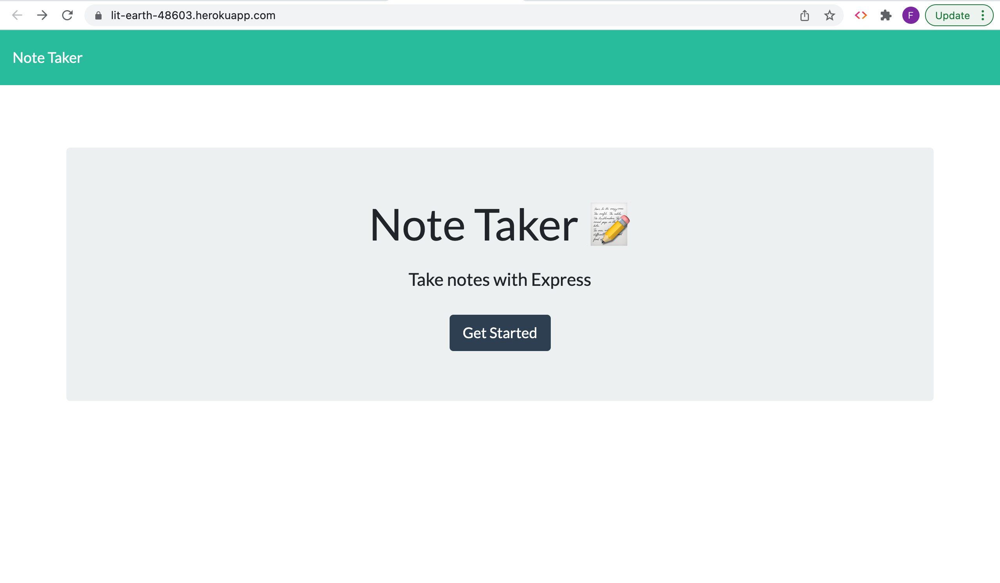
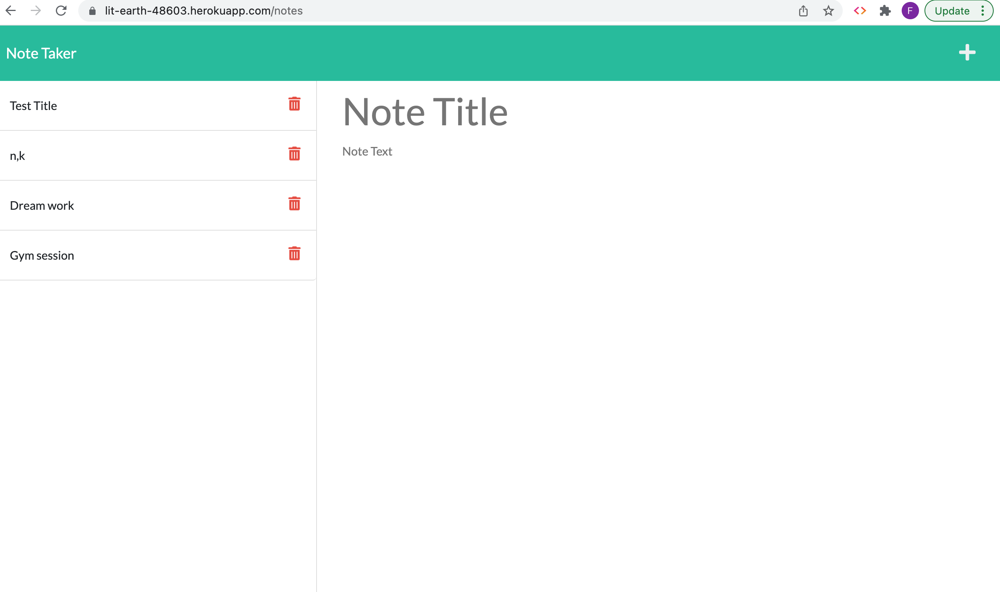
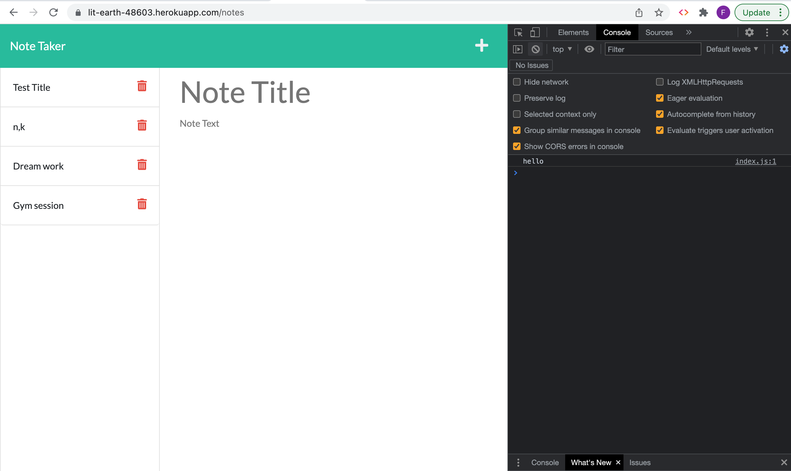
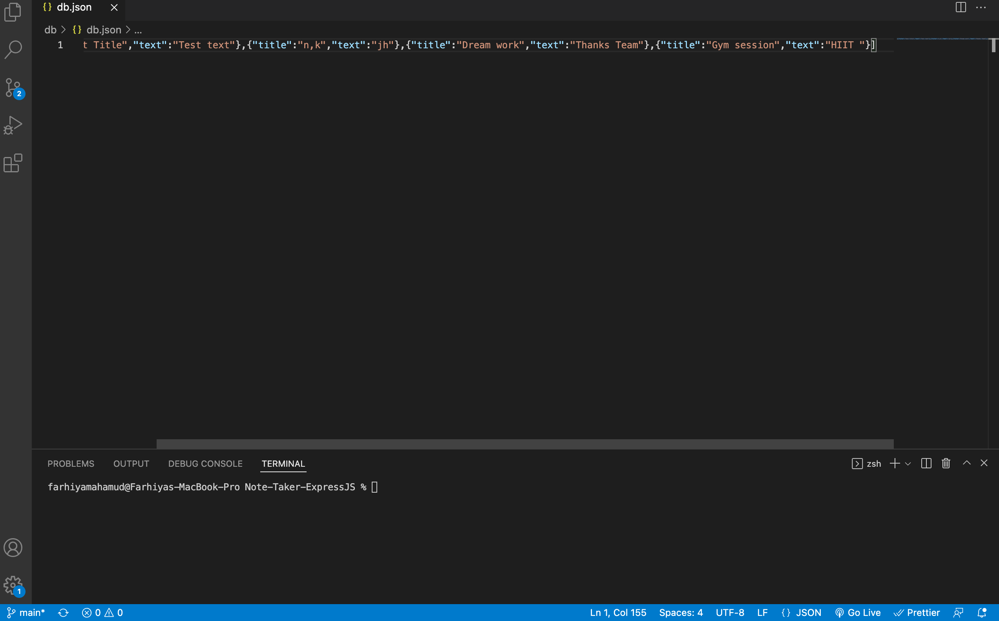

# Note-Taker-ExpressJS

Creating a Note Taker that can be used to write and save notes.

# Why did I build this project?

To create an application using Express.js and persistent storage that will allow users to take notes via a web interface. This is done by creating POST and GET routes to add and retrieve notes from persistent storage. The application features a sleek interface and demonstrate my current skills and knowledge of Express.js and routing. The Note Taker application will then be deployed to Heroku using the Heroku CLI.

# So far I have achieved?

1. To develop my research skills and troubleshooting. I was able to Understand errors with panicking and be able to research errors, and find a solution.

2. Creating and deploying apps using heroku.

3. Have the application functioning.

# What I intend to add in the near future?

1. To continue to build on it with the skills I continue to gain. Be able to acces the notes once clicked on it and delete the notes.

## User Story

```
AS A small business owner
I WANT to be able to write and save notes
SO THAT I can organize my thoughts and keep track of tasks I need to complete
```

## Acceptance Criteria Set To Achieve This

```
GIVEN a note-taking application
WHEN I open the Note Taker
THEN I am presented with a landing page with a link to a notes page

WHEN I click on the link to the notes page
THEN I am presented with a page with existing notes listed in the left-hand column, plus empty fields to enter a new note title and the note’s text in the right-hand column

WHEN I enter a new note title and the note’s text
THEN a Save icon appears in the navigation at the top of the page

WHEN I click on the Save icon
THEN the new note I have entered is saved and appears in the left-hand column with the other existing notes

WHEN I click on an existing note in the list in the left-hand column
THEN that note appears in the right-hand column

WHEN I click on the Write icon in the navigation at the top of the page
THEN I am presented with empty fields to enter a new note title and the note’s text in the right-hand column
```

# To access this project the following links are provided:

To access Github Repository

1. https://github.com/Farhiya1/Note-Taker-ExpressJS.git

To access deployed application Demo on heroku link

2.  https://lit-earth-48603.herokuapp.com/

# Screenshot of deployed application)

1. Screenshot displaying Note Taker application deployed on Heroku.



2. Screenshots of deployed note taker with saved notes.



3. Screenshots of deployed note taker with no errors showing in console.



4. Screenshot of db.json file with saved notes text.



# References

1. https://www.npmjs.com/package/inquirer
2. https://www.w3schools.com/nodejs/nodejs_filesystem.asp
3. https://expressjs.com/
4. https://developer.mozilla.org/en-US/docs/Web/JavaScript/Reference/Global_Objects/JSON
5. https://expressjs.com/en/guide/routing.html
